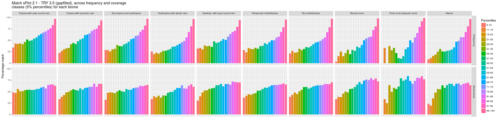

Generating figures visualizing the match between sPlot 2.1 and TRY 3.0
================
Oliver Purschke
14 August, 2017

This document describes the workflow of generating some figures that visualize the match between (i) global vegetation plot database sPlot version 2.1 and (ii) the global plant trait data base TRY version 3.

Load required packages
======================

    library(ggplot2)
    library(plyr)
    library(dplyr)
    library(reshape)
    library(foreach)

Loading Data
============

sPlot species data
------------------

Loading a reduced version of 'splot\_20161025\_species', DT2\_small,
that just contains the columns 'PlotObservationID', 'species' and
'Relative.cover':

    load("/home/oliver/Dokumente/PhD/PostPhD/IDiv/sDiv/sPlot/Analyses/Data/Species/sPlot/
    sPlot_2017_08_04/splot_20161025_species_small.Rdata")
    gc()

    dim(DT2_small)

    ## [1] 22195966        3

    head(DT2_small)

    ##   PlotObservationID                 species Relative.cover
    ## 1                15    Festuca brachyphylla     0.20000000
    ## 2                15      Potentilla elegans     0.75000000
    ## 3                15 Saxifraga serpyllifolia     0.05000000
    ## 4                16    Festuca brachyphylla     0.27777778
    ## 5                16      Potentilla elegans     0.69444444
    ## 6                16 Saxifraga serpyllifolia     0.02777778

Header data
-----------

Includes a reduced version of 'splot\_20161124\_header', mainly
containing the biome-affiliation and the X-Y-coordinates of each plot:

    load("/home/oliver/Dokumente/PhD/PostPhD/IDiv/sDiv/sPlot/Analyses/Data/Species/sPlot/
    sPlot_2017_08_04/splot_20161124_header_small.Rdata")
    gc()

    coord.biome <- header_small

Trait data
----------

Loading the gapfilled trait data from TRY 3.0:

    try3gapfilled <- read.csv("/home/oliver/Dokumente/PhD/PostPhD/IDiv/sDiv/sPlot/Analyses/
    Data/Traits/TRY_3.0_gapfilled/Export_sPlot_2016_09_12.csv", stringsAsFactors = F)
    gc()

    dim(try3gapfilled)

    ## [1] 632938     34

    names(try3gapfilled)

    ##  [1] "ObservationID"           "X1"                     
    ##  [3] "X4"                      "X11"                    
    ##  [5] "X13"                     "X14"                    
    ##  [7] "X15"                     "X18"                    
    ##  [9] "X26"                     "X27"                    
    ## [11] "X47"                     "X50"                    
    ## [13] "X56"                     "X78"                    
    ## [15] "X138"                    "X163"                   
    ## [17] "X169"                    "X237"                   
    ## [19] "X282"                    "ObservationID.2"        
    ## [21] "AccSpeciesID"            "Species"                
    ## [23] "Genus"                   "Family"                 
    ## [25] "PhylogeneticGroup"       "Exposition"             
    ## [27] "Maturity"                "PlantGrowthForm"        
    ## [29] "LeafType"                "LeafCompoundness"       
    ## [31] "TypicalNumberOfLeaflets" "DbComment"              
    ## [33] "ObservationID.1"         "name.short.correct"

Taxonomic backbone
------------------

    load("/home/oliver/Dokumente/PhD/PostPhD/IDiv/sDiv/sPlot/Analyses/Code/
    backbone.splot2.1.try3.is.vascular.Rdata")
    gc()

Matching species with biomes
============================

    DTMatch <- dplyr::left_join(DT2_small, coord.biome[,c(1,5)], by = "PlotObservationID")

    head(DTMatch)

    ##   PlotObservationID                 species Relative.cover       Biome
    ## 1                15    Festuca brachyphylla     0.20000000 Boreal zone
    ## 2                15      Potentilla elegans     0.75000000 Boreal zone
    ## 3                15 Saxifraga serpyllifolia     0.05000000 Boreal zone
    ## 4                16    Festuca brachyphylla     0.27777778 Boreal zone
    ## 5                16      Potentilla elegans     0.69444444 Boreal zone
    ## 6                16 Saxifraga serpyllifolia     0.02777778 Boreal zone

    table(DTMatch$Biome)

    ## 
    ##                        Alpine                   Boreal zone 
    ##                        422923                        417748 
    ##              Dry midlatitudes    Dry tropics and subtropics 
    ##                        491939                        318004 
    ##       Polar and subpolar zone Subtrop. with year-round rain 
    ##                         44738                        666686 
    ##   Subtropics with winter rain        Temperate midlatitudes 
    ##                       2189688                      17061718 
    ##      Tropics with summer rain  Tropics with year-round rain 
    ##                        341649                        229810

Summarizing species information
===============================

Calculating species species frequency and average cover
-------------------------------------------------------

    spec.group <- group_by(DTMatch, species)
    spec.agg.splot2.vasc <- summarise(spec.group, count.spec = n(),
                                      Avg_Cover_Perc = mean(Relative.cover))

Classify species according to frequency and dominance
-----------------------------------------------------

Assigning frequency classes:

    quantile(spec.agg.splot2.vasc$count.spec,(0:4)/4)

    ##     0%    25%    50%    75%   100% 
    ##      1      3     13     55 128942

    fac1 <- cut(as.numeric(spec.agg.splot2.vasc$count.spec),
                quantile(spec.agg.splot2.vasc$count.spec,(0:4)/4),
                labels=c("Low","Medium","High","Highest"))

Assigning dominance classes:

    quantile(spec.agg.splot2.vasc$Avg_Cover_Perc,(0:4)/4)

    ##           0%          25%          50%          75%         100% 
    ## 2.099379e-06 9.660214e-03 1.963825e-02 3.998146e-02 1.000000e+00

    fac2 <- cut(as.numeric(spec.agg.splot2.vasc$Avg_Cover_Perc),
                quantile(spec.agg.splot2.vasc$Avg_Cover_Perc,(0:4)/4),
                labels=c("Low","Medium","High","Highest"))
    spec.agg.splot2.vasc$count.fac <- fac1
    spec.agg.splot2.vasc$cover.fac <- fac2

Because we are interested in percentiles of the whole population of the
50,000+ species, I calculate 5% percentiles based on species ranks
instead of their actual values:

    spec.count.rank<-rank(spec.agg.splot2.vasc$count.spec, ties.method = "first")
    fac1 <- cut(spec.count.rank, quantile(spec.count.rank, probs=0:20/20), include.lowest=TRUE,
                labels=1:20)
    table(fac1)

    ## fac1
    ##    1    2    3    4    5    6    7    8    9   10   11   12   13   14   15 
    ## 2904 2903 2903 2903 2904 2903 2903 2903 2903 2904 2903 2903 2903 2903 2904 
    ##   16   17   18   19   20 
    ## 2903 2903 2903 2903 2904

    spec.cover.rank<-rank(spec.agg.splot2.vasc$Avg_Cover_Perc, ties.method = "first")
    fac2 <- cut(spec.cover.rank, quantile(spec.cover.rank, probs=0:20/20), include.lowest=TRUE,
                labels=1:20)
    table(fac2)

    ## fac2
    ##    1    2    3    4    5    6    7    8    9   10   11   12   13   14   15 
    ## 2904 2903 2903 2903 2904 2903 2903 2903 2903 2904 2903 2903 2903 2903 2904 
    ##   16   17   18   19   20 
    ## 2903 2903 2903 2903 2904

    spec.agg.splot2.vasc$count.fac.20 <- fac1
    spec.agg.splot2.vasc$cover.fac.20 <- fac2

TRY species list
================

Match names in TRY with the backbone and generate a list of unique,
resolved names of orginal (partly unresolved) names in TRY:

    index2 <- match(try3gapfilled$Species, backbone.splot2.1.try3$names.sPlot.TRY)
    try3gapfilled$name.short.correct <- backbone.splot2.1.try3$name.short.correct[index2]

    str(try3gapfilled)

    ## 'data.frame':    632938 obs. of  34 variables:
    ##  $ ObservationID          : num  15472 15473 15474 15475 15476 ...
    ##  $ X1                     : num  2520 8500 7122 4917 2587 ...
    ##  $ X4                     : num  0.607 0.567 0.511 0.52 0.47 ...
    ##  $ X11                    : num  18 21.6 15.3 14 16.7 ...
    ##  $ X13                    : num  468 478 471 478 477 ...
    ##  $ X14                    : num  19.2 20.5 22.5 22.2 27.6 ...
    ##  $ X15                    : num  1.87 1.9 2.13 1.52 2 ...
    ##  $ X18                    : num  8.96 19.15 24.27 23.01 15.26 ...
    ##  $ X26                    : num  17.766 64.555 49.765 7190.923 0.914 ...
    ##  $ X27                    : num  14.23 18.58 18.96 33.89 2.51 ...
    ##  $ X47                    : num  0.255 0.349 0.34 0.294 0.299 ...
    ##  $ X50                    : num  1.24 0.937 1.508 1.633 1.622 ...
    ##  $ X56                    : num  8.99 11.24 11.73 15.23 12.41 ...
    ##  $ X78                    : num  1.494 5.805 4.072 0.837 1.117 ...
    ##  $ X138                   : num  67.66 1.65 132.23 32.09 48.35 ...
    ##  $ X163                   : num  0.428 1.272 1.6 5.514 0.427 ...
    ##  $ X169                   : num  77.6 239.5 149.7 93.5 98 ...
    ##  $ X237                   : num  12.43 26.62 25.18 33.77 2.73 ...
    ##  $ X282                   : num  725 237 227 615 512 ...
    ##  $ ObservationID.2        : int  15472 15473 15474 15475 15476 15477 15478 15479 15480 15481 ...
    ##  $ AccSpeciesID           : int  797 854 855 1571 2710 2736 3184 4447 6088 7230 ...
    ##  $ Species                : chr  "Acer campestre" "Acer platanoides" "Acer pseudoplatanus" "Aesculus hippocastanum" ...
    ##  $ Genus                  : chr  "Acer" "Acer" "Acer" "Aesculus" ...
    ##  $ Family                 : chr  "Aceraceae" "Aceraceae" "Aceraceae" "Hippocastanaceae" ...
    ##  $ PhylogeneticGroup      : chr  "Angiosperm_Eudicotyl" "Angiosperm_Eudicotyl" "Angiosperm_Eudicotyl" "Angiosperm_Eudicotyl" ...
    ##  $ Exposition             : chr  "" "" "" "" ...
    ##  $ Maturity               : chr  "" "" "" "" ...
    ##  $ PlantGrowthForm        : chr  "tree" "tree" "tree" "tree" ...
    ##  $ LeafType               : chr  "broadleaved" "broadleaved" "broadleaved" "broadleaved" ...
    ##  $ LeafCompoundness       : chr  "simple" "simple" "simple" "compound" ...
    ##  $ TypicalNumberOfLeaflets: int  1 1 1 6 1 1 1 1 1 1 ...
    ##  $ DbComment              : chr  "" "" "" "" ...
    ##  $ ObservationID.1        : int  15472 15473 15474 15475 15476 15477 15478 15479 15480 15481 ...
    ##  $ name.short.correct     : chr  "Acer campestre" "Acer platanoides" "Acer pseudoplatanus" "Aesculus hippocastanum" ...

Generate a list of unique, resolved names of orginal (partly unresolved)
names in TRY:

    names.try <- unique(try3gapfilled$name.short.correct)
    length(names.try)

    ## [1] 52033

There are 52033 unique resolved species in TRY.

    length(unique(try3gapfilled$Species))

    ## [1] 59319

There are 59319 unique but partly unresolved species in TRY. Means that
12.3% of the gapfilled species in TRY3.0 are Synonyms (or to a small
extent species where no suitable name matches were found).

Calculate match between sPlot and TRY
=====================================

    biome.group <- group_by(DTMatch, Biome)

    biome.trait.match.freq.dom <- foreach(i = 6:7, .combine = rbind) %:% 
        foreach(j = 2:20, .combine = cbind) %do% {                   
            index3 <- which(spec.agg.splot2.vasc[,i] == j)
            names.freq.dom <- unique(spec.agg.splot2.vasc$species[index3])   
            biome.group.small <- biome.group[which(biome.group$species %in% names.freq.dom), ]    
            x <- dplyr::summarise(biome.group.small,
                                  match.splot.try =
                                      100*(length(unique(species)
                                                  [which(unique(species) %in%
                                                         names.try)])/length(unique(species))))[,2]
            x
        }

    gc()

Assign names to match stats
---------------------------

Take the nineteen 5% percentiles as colnames. Skip the lowest percentile
as it could not be calculated for the some of the biomes.

    a <- seq(6, 100, 5)
    b <- seq(10, 100, 5)
    nam <- paste(a,b, sep = "-")
    colnames(biome.trait.match.freq.dom) <- nam

Use the Biom in 'Schulz\_Bio' as first column.

    biome.trait.match.agg <-
        dplyr::summarise(biome.group,
                         match.splot.try =
                             100*(length(unique(species)[which(unique(species) %in%
                                                               names.try)])/length(unique(species))))

    biome.trait.match.freq.dom2 <- cbind(rep(biome.trait.match.agg$Biome, 2),
                                         biome.trait.match.freq.dom)
    colnames(biome.trait.match.freq.dom2)[1] <- "Schulz_Bio"

    biome.trait.match.3 <- biome.trait.match.freq.dom2 %>% 
        dplyr::filter(!is.na(Schulz_Bio)) %>% 
        dplyr::select(1:20) %>%
        reshape::melt("Schulz_Bio") %>%
        dplyr::mutate(freq.dom = rep(c("Frequency", "Dominance"), 19, each = 10))

    head(biome.trait.match.3)

    ##                      Schulz_Bio variable     value  freq.dom
    ## 1                        Alpine     6-10  8.333333 Frequency
    ## 2                   Boreal zone     6-10  3.571429 Frequency
    ## 3              Dry midlatitudes     6-10 21.052632 Frequency
    ## 4    Dry tropics and subtropics     6-10 29.057592 Frequency
    ## 5       Polar and subpolar zone     6-10  0.000000 Frequency
    ## 6 Subtrop. with year-round rain     6-10 32.063492 Frequency

    tail(biome.trait.match.3)

    ##                        Schulz_Bio variable    value  freq.dom
    ## 375       Polar and subpolar zone   96-100 76.92308 Dominance
    ## 376 Subtrop. with year-round rain   96-100 70.00000 Dominance
    ## 377   Subtropics with winter rain   96-100 60.63250 Dominance
    ## 378        Temperate midlatitudes   96-100 65.59140 Dominance
    ## 379      Tropics with summer rain   96-100 66.93712 Dominance
    ## 380  Tropics with year-round rain   96-100 63.01775 Dominance

Bring 'biomes names' and 'freq.dom' in a sensible order:

    biome.trait.match.3$Schulz_Bio <-
        factor(biome.trait.match.3$Schulz_Bio, levels=c("Tropics with year-round rain",
                                                      "Tropics with summer rain",
                                                      "Dry tropics and subtropics",
                                                      "Subtropics with winter rain",
                                                      "Subtrop. with year-round rain",
                                                      "Temperate midlatitudes",
                                                      "Dry midlatitudes",
                                                      "Boreal zone",
                                                      "Polar and subpolar zone",
                                                      "Alpine"))

    biome.trait.match.3$freq.dom <- factor(biome.trait.match.3$freq.dom,
                                           levels=c("Frequency", "Dominance"))

Generate the Figure
===================

    ggplot(biome.trait.match.3, aes(variable, value, fill=variable)) + 
      geom_bar(stat="identity", position="dodge")+
        facet_grid(freq.dom ~ Schulz_Bio) +
        theme(axis.text.x=element_blank(),
              axis.ticks.x=element_blank(), 
              axis.title.x=element_blank()) +
        xlab("Biomes") +
        ylab("Percentage match")+  
        guides(fill=guide_legend(title="Percentiles"))  +
        ggtitle("Match sPlot 2.1 - TRY 3.0 (gapfilled), across frequency and coverage
    classes (5% percentiles) for each biome")

Save the figure
---------------

    ggsave("Match TRY3-sPlot2.1.biome_Freq_Dom_5_perc.png", plot = last_plot(), device = "png",
           path = NULL, scale = 1, width = 10, height = 5, units = c("mm"), dpi = 300,
           limitsize = TRUE)
